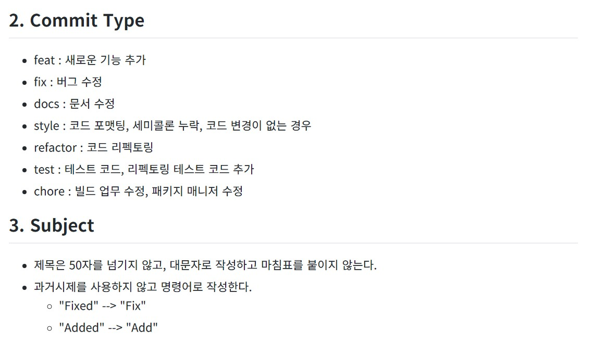

# peer session
Boost AI Camp Group 2  
피어세션 소스공유를 위한 깃헙

## Q&A (Updated ~ 2021.01.21)
- Decorator의 역할...?
- python에서 property가 하는 역할과 private변수

---
## 1. prob 정리

1. [다리를 지나는 트럭 - programmers](https://programmers.co.kr/learn/courses/30/lessons/42583), 스택/큐
2. [타겟 넘버 - programmers](https://programmers.co.kr/learn/courses/30/lessons/43165), dfs/bfs

## [2. git 사용법](https://jeonghwan-kim.github.io/dev/2020/02/10/git-usage.html)

### 2.0) 깃 상태 확인하기
```bash
git status
```
> 현재, 어떤 파일을 올릴 수 있는지 확인 가능하다.
---
### 2.1) 현재 디렉토리 최신화 (시점 맞추기)  
**저장소의 최신버전을 유지한 후 변경분을 반영하기 위함**
1) 보통은 pull 로 최신화.
```bash
git pull (origin main 생략 가능)
```
2) 다른 사용자가 코드를 push해놓은 경우 (패치)  
```bash
git fetch (origin main 생략)
```

> origin - 원격저장소 이름  
> main - branch name 을 뜻한다.  


### 2.2) 서버에 반영하기 전 대기시키기 (`staging`)  

```bash
git add . // 모든 변경사항 staging
git add *.py // 확장자 py에 대한 모든 변경사항 
git add [file_name].py // 파일 하나만 올리기
```

### 2.3) 로컬 서버에 반영하기 (`commit`)
```bash
git commit -m "메세지 입력" // staging file 저장
git commit -am "메세지 입력" // staging + commit 한번에
```
**`[참고]` commit message name convention**  

  
예시)
> - Add myFile  
> - Fix type in README

### 2.4) 원격서버에 동기화(`push`)
**로컬서버에 commit된 내용을 git에도 반영**
```bash
git push (origin main)
```
